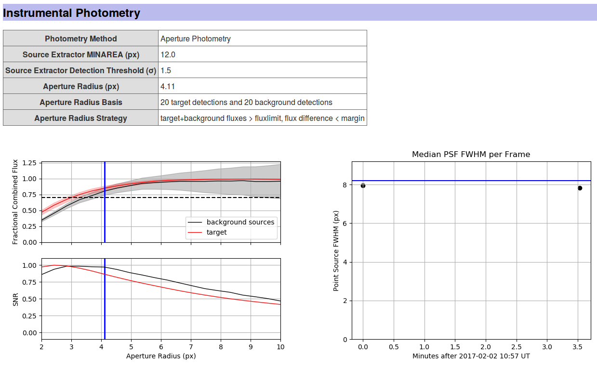
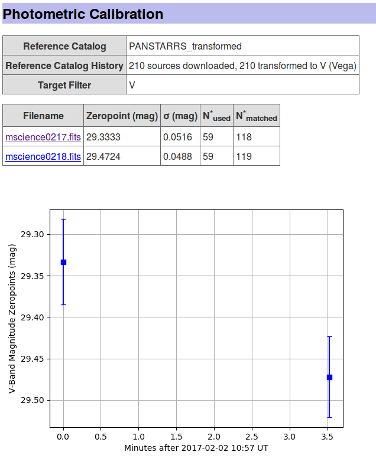
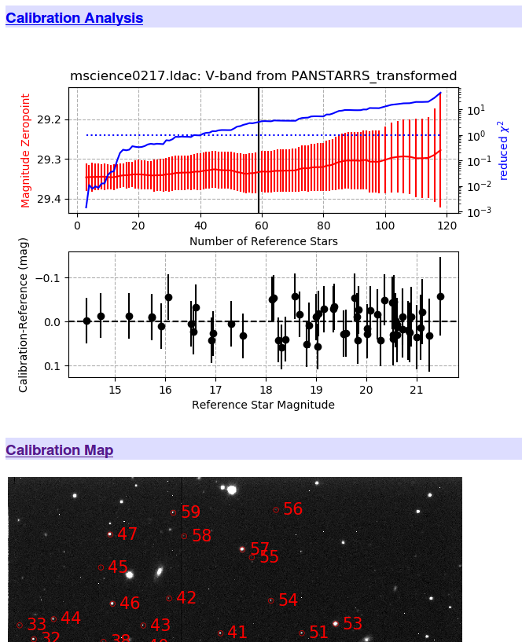

.. _diagnostics:

Diagnostics
===========

PP creates extensive diagnostic output to provide the user
with a comfortable way to verify the quality of the derived
results. Focusing on human readability, the diagnostic output is in
the form of a HTML website that is accessible with any web browser.

An example diagnostic output is provided `here <http://mommermi.github.io/pp_diagnostics/diagnostics.html>`_.

Overview
--------

HTML Output
~~~~~~~~~~~

The diagnostic output for one specific data set can be accessed by
opening the ``diagnostics.html`` website that is by default created in
the respective data directory, e.g., using::

  firefox diagnostics.html

Data presented in this website are all stored in a sub-directory named
``.diagnostics/`` in the respective data directory (note that the dot
prefix makes this a hidden directory). 

LOG File
~~~~~~~~

All tasks performed by PP are documented using Python's logging
system. The LOG file is linked from the ``diagnostics.html`` file (see
top of the page). The LOG file can be used to check proper performance
of the pipeline. Its main purpose is to simplify debbuging in case
something went wrong. The LOG file is by default created in the
respective data directory.

Diagnostics Details
-------------------

The following sections discuss the output of a successful pipeline run
in detail based on `this <http://mommermi.github.io/pp_diagnostics/diagnostics.html>`_ example page.

Overview Information
~~~~~~~~~~~~~~~~~~~~

The top of the diagnostics website lists the data directory, some
general information like the telescope/instrument combination, as well
as the total number of frames processed. The process LOG file (see
above) is linked here, too.

All the frames considered in the process are listed in the `Data
Summary` table, providing information on the date and time, target,
filter, airmass, exposure time, and field of view. By default, the
frame name links to a separate page with more information on that
specific frame.

Registration
~~~~~~~~~~~~

The first line of this section lists the astrometric catalog that was
used in the registration and whether the registration was successfull,
or not.  The following table lists for each frame some diagnostics
provided by SCAMP, including C:subscript:`AS` and C:subscript:`XY`
that indicate the goodness of the frame's rotation angle and scale,
and the frame's shift, respectively. :math:`\sigma`:subscript:`RA` and
:math:`\sigma`:subscript:`DEC` provide a sense for positional uncertainties
in arcsecs; :math:`\chi`:superscript:`2`:subscript:`Reference` and
:math:`\chi`:superscript:`2`:subscript:`Internal` quantify the goodness of
fit. For additional information on these parameters, please refer to
the `SCAMP manual`_. By default, the image filenames lead to a
separate frame report page.

Instrumental Photometry
~~~~~~~~~~~~~~~~~~~~~~~

The optimum aperture size used by PP is determined using a
curve-of-growth analysis. Details on how the optimum aperture was
derived is provided in this section.

The **left plot** documents the curve-of-growth analysis. For a range
of aperture sizes, the flux and SNR of both the target (red line) and
the average over all background sources (black line) are
determined. Note that both the flux and the SNR are fractional
values - they are relative to the maximum flux (of either the target
or the background stars) or the maximum SNR. In order to obtain
reliable photometry, you want to include as much flux as possible but
at the same time keep the aperture as small as possible, in order to
minimize noise introduced by the background - this is reflected by the
SNR's peak (see, e.g, Howell's *Handbook of CCD Astronomy* for a
discussion). PP deliberately does not use the aperture radius that
provides the highest SNR. The optimum aperture radius is required to
include at least 70% of the both the target's and background sources'
flux - at the same time, the fractional flux difference between the
target and background sources has to be smaller than 5%. Both
conditions minimize the effect of potential trailing on the photometry
results. The optimum aperture radius is chosen as the smallest
aperture radius that meets the conditions listed above.

The **right plot** shows the median PSF full-width-half-max (FWHM)
based on all sources in the field as a function of time. The red line
indicates the optimum aperture diameter for comparison. The measured
FWHMs should be below the blue line, meaning that the aperture
diameter is slightly larger than the image FWHM.  Variations in the
FWHM can be caused by seeing variations and or focus shifts. Note that
in the case of badly focused images, the measured FWHM is a bad
indicator of the real FWHM. By default, you can click on the data
points on the FWHM plot, which will take you to the respective frame
page.

Photometric Calibration - Catalog Match
~~~~~~~~~~~~~~~~~~~~~~~~~~~~~~~~~~~~~~~

PP provides an automated photometric calibration based on a number of
different star catalogs. The calibration process is summarized on the
diagnostics website with a plot of the magnitude zeropoint as a
function of time:

Variations in the magnitude zeropoint are due to changes in the
airmass, as well as due to transparency and seeing variations (see
FWHM plot above). 

In addition to the overview plot, PP provides detailed information
on the respective frame page as shown below:

The `Calibration Analysis` shows the magnitude zeropoint (red line) as
a function of the number of background catalog stars used in the
calibration.  The number of background stars is reduced by rejecting
the most significant outlier at a time. The blue line shows the
reduced &chi;:superscript:`2` of the remaining data points; the dotted
blue line indicates a reduced &chi;:superscript:`2` of 1. Currently,
50% of all background stars are rejected (vertical line) based on
their weighted residuals; weights account for photometric
uncertainties and catalog uncertainties. This representation shows
that the magnitude zeropoint does not depend on the number of
background stars used in the calibration. Further options include a
`Calibration Map`, the actual image overplotted with those stars that
were used in the final calibration, and the `Calibration Data Table`
listing all background stars used in the final calibration.

Photometry Results
~~~~~~~~~~~~~~~~~~

PP provides final photometry for the actual target(s) in the field, as
well as for one reasonably bright star that acts as a **Control
Star**. The Control Star is derived using the exact same calibrations
and routines as the target, providing a good verification of the whole
process. Usually, the Control Star should have a flat lightcurve
that does not show significant variations. However, it cannot be ruled
out that the comparison star shows intrinsic variability, or is
subject to detector effects, leading to photometric variability. The
comparison star is required to be present in the first and the last
image of the sequence of images provided.

For each target, PP
provides a GIF animation and a lightcurve showing calibrated
photometry. The individual frames in the GIF show the expected target
position (blue cross) and the actual aperture placement and size used
(red circle). The GIF allows for identifying target mismatches and
contaminations of the photometry aperture. A 
is featured for each target, allowing for a quick and easy
identification of corrupted frames. 

The individual frame page allows for inspecting the corresponding
thumbnail image in which the overlay information can deactivated:

.. figure:: phot_results.png
    :alt: photometry results 
    :figclass: align-center

.. _SCAMP manual: https://www.astromatic.net/pubsvn/software/scamp/trunk/doc/scamp.pdf
